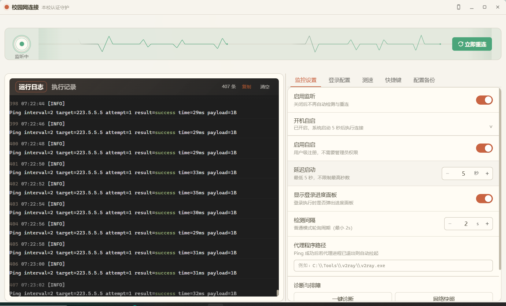
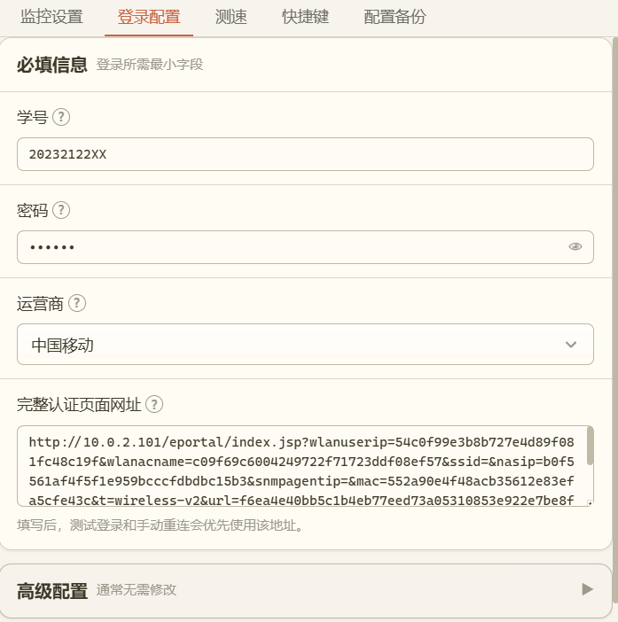

# 移通学院校园网自动连接

一款仅适用于重庆移通学院的 Windows 10/11 校园网自动连接工具，提供校园网自动登录、断线重连和后台守护功能。

> 本仓库仅发布已经打包的 Windows EXE 安装程序，不上传项目源代码、个人配置、账号信息或运行日志。

[下载 v0.1.0 Windows x64 测试版](https://github.com/moos1110/yitong-campus-net-guardian/releases/tag/v0.1.0)

> [!WARNING]
> 当前版本为测试版，可能存在尚未发现的稳定性、兼容性或功能问题，不能保证完全稳定、无缺陷或适用于所有网络环境。使用前请保留校园网手动登录方式，并及时备份自己的配置。

## 适用范围

本项目只适用于重庆移通学院校园网，包括用户常用的“移通学院校园网”“移通校园网”“重庆移通校园网”等名称。其他学校的认证接口、运营商参数和网络环境可能不同，不保证能够使用。

## 项目功能

- 自动检测当前网络和校园网认证状态
- 断网后按规则自动重新登录
- 托盘常驻，减少对正常使用的打扰
- 支持开机自启动和静默启动
- 支持多网卡环境和偏好网卡选择
- 提供运行日志、错误提示和登录测试
- 支持配置导入导出与网络状态查看
- 提供“关于”页面，集中显示作者、版本、发布信息和 GitHub 项目入口
- 提供带详细确认信息的完整卸载程序

## 系统要求

- Windows 10 或 Windows 11
- x64 处理器架构
- 能够正常连接重庆移通学院校园网
- 安装时保持网络可用，以便系统在需要时补充 WebView2 Runtime

## 下载与安装

1. 打开仓库的 `Releases` 页面。
2. 下载 Windows x64 测试版 EXE 安装包。
3. 双击安装并按界面提示完成操作。
4. 首次启动后进入“设置 → 登录配置”。
5. 填写基础配置并执行一次“测试登录”。

当前采用单用户安装方式，通常不需要管理员权限。

## 最基础的必要配置

首次使用需要完成以下四项基础配置：

| 配置项 | 是否必填 | 填写方法 |
| --- | --- | --- |
| 学号 | 必填 | 填写校园网账号，通常是学号或工号 |
| 密码 | 必填 | 填写校园网密码；如果已有可用的加密密码，也可以在高级配置中改用加密密码 |
| 运营商 | 必填 | 根据重庆移通学院校园网的实际套餐选择中国移动、中国电信、中国联通或中国广电 |
| 完整认证页面网址 | 必填 | 使用浏览器打开重庆移通学院校园网认证页面，复制地址栏中的完整网址并粘贴到该配置项 |

推荐配置顺序：

1. 填写学号和密码。
2. 选择实际使用的运营商。
3. 在浏览器中打开校园网认证页面，复制完整网址并填写“完整认证页面网址”。
4. 点击“保存配置”。
5. 点击“测试登录”。
6. 测试成功后返回主页面启用网络监控。

其他配置通常保持默认值即可。不要把自己的账号、密码、配置备份或日志上传到仓库。

## 日常使用

- 主页面可查看在线状态、延迟、监控状态和最近登录结果。
- 隐藏主窗口后，程序会继续在系统托盘运行。
- 需要暂停自动登录时，可临时关闭监控，不必退出程序。
- 开启开机自启动后，程序会按设置的延迟时间静默启动。
- 遇到登录失败时，先使用“测试登录”查看明确提示。

## 卡顿排查

如果程序出现卡顿，请手动清空日志：在“运行日志”右上角点击“清空”。该操作只清空当前界面中的日志记录，不会删除磁盘中的本次开机日志文件。

当前测试版在界面日志达到 500 条时会自动删除最旧的 300 条，以减少长时间运行后的渲染和动画开销。如果清空后仍然卡顿，可以退出程序后重新启动，并在反馈问题前检查日志中是否包含个人网络信息。

## 完全卸载

可以通过以下任一方式卸载：

1. 打开 Windows“设置 → 应用 → 已安装的应用”，找到“校园网连接”并卸载。
2. 打开程序安装目录，双击卸载程序。

卸载确认页提供“同时删除 6 个设置、日志和锁文件（不勾选则保留）”复选框：

- 不勾选：删除主程序、卸载器、快捷方式、自启动项和产品注册表项，但保留下面 6 个用户文件，安装目录会继续存在，便于重新安装后沿用配置。
- 勾选：再次弹窗列出完整清单并提示删除后无法恢复；确认后同时删除下面 6 个文件以及可能遗留的配置临时文件，目录为空时也会一并移除。

可选删除的 6 个文件：

- `campus-net-guardian.instance.lock`
- `panic.log`
- `配置文件.json`
- `校园网连接.本次开机日志.log`
- `校园网连接.错误.log.txt`
- `校园网连接.设置.json`

其中 `配置文件.json` 可能包含校园网账号配置。需要保留配置时不要勾选；准备彻底移除时再勾选。无论是否保留这些文件，卸载列表项、自启动项和本项目的产品注册表项都会删除。系统 WebView2 Runtime、Windows 网络配置以及其他软件的数据不会被删除。

## 高级使用方法

以下选项只建议在基础配置无法满足实际网络环境时使用：

### 更新完整认证页面网址

“完整认证页面网址”属于基础必填项。如果学校更换认证入口、原网址失效或测试登录提示页面不可用，请重新用浏览器打开当前认证页面，复制地址栏中的完整网址并更新该配置。

### 多网卡绑定

电脑同时连接有线网、无线网、虚拟网卡或 VPN 时，可在高级配置中选择“偏好网卡”，指定实际连接校园网的网卡。普通单网卡用户保持自动选择即可。

### 监控频率

可以根据网络稳定程度调整常规检测间隔。间隔过短会增加网络请求，间隔过长则会延迟断网发现时间，建议先使用默认值。

### 开机启动延迟

如果开机后校园网网卡初始化较慢，可以适当增加自启动延迟，避免程序过早判断网络异常。

### 代理程序恢复

确实需要配合本地代理工具时，可以配置可信代理程序的路径。不要选择来源不明的可执行文件。

### 日志排查

登录或重连异常时，先查看应用内日志和错误提示。向他人提供日志前，应人工检查并删除可能包含个人网络环境的信息。

## 使用许可

本项目使用《霜天红叶非商业禁止篡改许可协议 1.0》。个人和其他非商业场景可以免费使用，也可以分享原始、未修改的安装包；禁止商用、修改、篡改、破解、重新打包、冒名发布或删除作者信息。

完整条款请阅读 [LICENSE](./LICENSE)。本项目不是开源软件。
